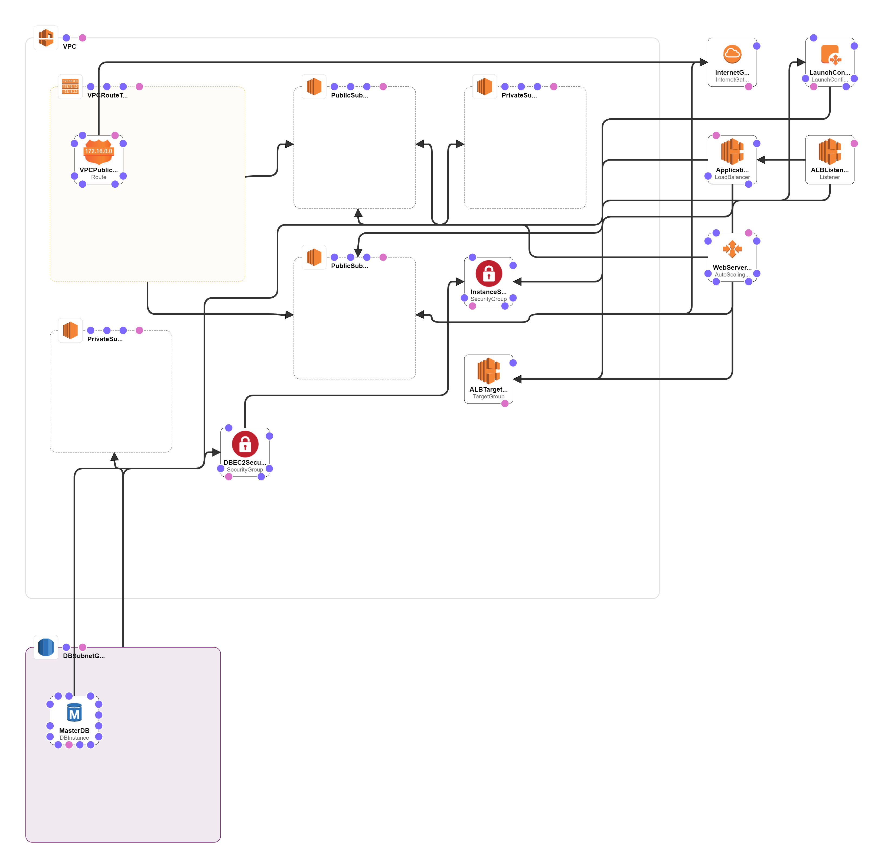

# Servian Techchallenge

## Proposed Soutions
The applications can be deployed over kubernets or virtual machines with auto scale features for high availability. This code helps to deploy the servian tech app over AWS EC2 instances with high available features.

## Used AWS Services
* VPC
* EC2 
* ALB
* Auto Scale
* RDS

## Infra Architecture

## Deploy Application
The application can be deployed in default port as per the code. Its also can be exposed to other port that can be accessed through the application load balancer.
